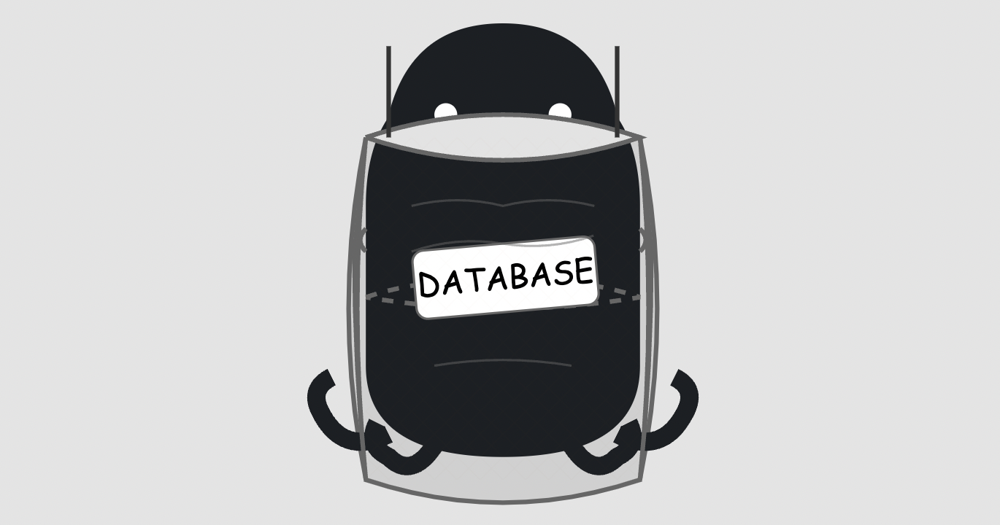

# Github Issues as a Data Store

The `gh-store` package provides a data store implementation that uses GitHub Issues as a backend. The primary intended use case is for "github native"  applications which are constrained to Github Actions as the only available runtime, and free-tier github resources.

The data storage pattern presented here is inspired by https://github.com/utterance/utterances

## Key Features
- Store and version JSON objects using GitHub Issues
- Atomic updates through a comment-based event system
- Point-in-time snapshots for static site generation
- Built-in GitHub Actions integration

## Installation

```bash
pip install gh-store  # Requires Python 3.12+
```

## Prerequisites
- GitHub repository with Issues enabled
- GitHub token with `repo` scope
- For GitHub Actions: `issues` write permission

## Basic Usage

```python
from gh_store.core.store import GitHubStore

store = GitHubStore(
    token="github-token",
    repo="username/repository"
)

# Create object
store.create("metrics", {
    "count": 0,
    "last_updated": "2025-01-16T00:00:00Z"
})

# Update object
store.update("metrics", {"count": 1})

# Get current state
obj = store.get("metrics")
print(f"Current count: {obj.data['count']}")
```

## System Architecture

gh-store uses GitHub Issues as a versioned data store. Here's how the components work together:

### 1. Object Storage Model

Each stored object is represented by a GitHub Issue:
```
Issue #123
├── Labels: ["stored-object", "UID:metrics"]
├── Body: Current object state (JSON)
└── Comments: Update history
    ├── Comment 1: Update {"count": 1}
    ├── Comment 2: Update {"field": "value"}
    └── Each comment includes the 👍 reaction when processed
```

Key components:
- **Base Label** ("stored-object"): Identifies issues managed by gh-store
- **UID Label** ("UID:{object-id}"): Uniquely identifies each stored object
- **Issue Body**: Contains the current state as JSON
- **Comments**: Store update history
- **Reactions**: Track processed updates (👍)

### 2. Update Process

When updating an object:
1. New update is added as a comment with JSON changes
2. Issue is reopened to trigger processing
3. GitHub Actions workflow processes updates:
   - Gets all unprocessed comments (no 👍 reaction)
   - Applies updates in chronological order
   - Adds 👍 reaction to mark comments as processed
   - Updates issue body with new state
   - Closes issue when complete

### 3. Core Components

- **GitHubStore**: Main interface for CRUD operations
- **IssueHandler**: Manages GitHub Issue operations
- **CommentHandler**: Processes update comments

## GitHub Actions Integration

### Process Updates

```yaml
# .github/workflows/process_update.yml
name: Process Updates

on:
  issues:
    types: [reopened]

jobs:
  process:
    runs-on: ubuntu-latest
    if: contains(github.event.issue.labels.*.name, 'stored-object')
    permissions:
      issues: write
    steps:
      - uses: actions/checkout@v4
      - name: Process Updates
        run: |
          gh-store process-updates \
            --issue ${{ github.event.issue.number }} \
            --token ${{ secrets.GITHUB_TOKEN }} \
            --repo ${{ github.repository }}
```

### Create Snapshots

```yaml
# .github/workflows/snapshot.yml
name: Snapshot

on:
  schedule:
    - cron: '0 0 * * *'  # Daily
  workflow_dispatch:

jobs:
  snapshot:
    runs-on: ubuntu-latest
    permissions:
      contents: write
    steps:
      - uses: actions/checkout@v4
      - name: Create Snapshot
        run: |
          gh-store snapshot \
            --token ${{ secrets.GITHUB_TOKEN }} \
            --repo ${{ github.repository }} \
            --output data/store-snapshot.json
```

## CLI Commands

```bash
# Process updates for an issue
gh-store process-updates \
  --issue <issue-number> \
  --token <github-token> \
  --repo <owner/repo>

# Create snapshot
gh-store snapshot \
  --token <github-token> \
  --repo <owner/repo> \
  --output <path>

# Update existing snapshot
gh-store update-snapshot \
  --token <github-token> \
  --repo <owner/repo> \
  --snapshot-path <path>
```

# Configuration

A default configuration is automatically created at `~/.config/gh-store/config.yml` when first using the tool. You can customize this file or specify a different config location:

```python
store = GitHubStore(
    token="github-token",
    repo="username/repository",
    config_path=Path("custom_config.yml")
)
```

Default configuration:

```yaml
# gh_store/default_config.yml

store:
  # Base label for all stored objects
  base_label: "stored-object"
  
  # Prefix for unique identifier labels
  uid_prefix: "UID:"
  
  # Reaction settings
  # Limited to: ["+1", "-1", "laugh", "confused", "heart", "hooray", "rocket", "eyes"]
  reactions:
    processed: "+1"
    initial_state: "rocket"
  
  # Retry settings for GitHub API calls
  retries:
    max_attempts: 3
    backoff_factor: 2
    
  # Rate limiting
  rate_limit:
    max_requests_per_hour: 1000
    
  # Logging
  log:
    level: "INFO"
    format: "{time} | {level} | {message}"
```

## Object History

Each object maintains a complete history from its initial state through all updates:

```python
# Get object history
history = store.issue_handler.get_object_history("metrics")

# History includes initial state and all updates
for entry in history:
    print(f"[{entry['timestamp']}] {entry['type']}")
    print(f"Data: {entry['data']}")
```

The history includes:
- Initial state with timestamp and data
- All updates in chronological order
- Each entry's comment ID for reference

History is tracked through:
- Initial state comment marked with 🚀
- Update comments marked with 👍 when processed
- All changes preserved in chronological order

## Limitations

- Not suitable for high volume or high velocity (GitHub API limits)
  - Unique objects per store is limited only by the number of unique issues and labels
  - Per experimentation by SO users, github supports at least 10k+ unique labels within a single repo
  - Even if this is theoretically unbounded, it is inadvisable to use this system if you plan to store more than 10k+ items
  - As concrete examples of undocumented github api limitations:
    - There is no limit to the number of repos a single user may star, but above 7k stars the native github frontend breaks
    - There is no limit to the number of stars that can be added to a single star list, but above 3k stars the number of pages exceeds 100, and newly added stars after the 3000th member of the list will not be retrievable via the star list endpoint.
- Objects limited to Issue size (~65KB)
  - Github supports 10MB attachments to issues/comments, so limited future blob support is feasible
- Updates processed asynchronously via GitHub Actions
- Sensitive data that should not be publicly visible

## Development

```bash
# Install dev dependencies
pip install -e ".[dev]"

# Run tests
pytest

# Type checking & linting
mypy .
ruff check .
```

## License

MIT License - see [LICENSE](LICENSE)
